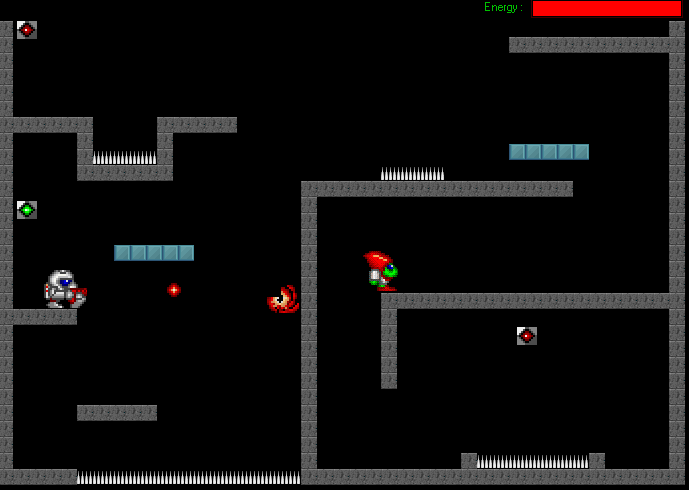



## A Platform Game

### Description

my second game trying. i tried about gravity and tile based screen. also enemy control. sorry for writing code in turkish but i wrote the commetns in english, yo can ask abou them...
 
### More Info
 

             |
---                |---
**Submitted On**   |2004-08-31 12:30:18
**By**             |[Erkan Kaynak](https://github.com/Planet-Source-Code/PSCIndex/blob/master/ByAuthor/erkan-kaynak.md)
**Level**          |Advanced
**User Rating**    |4.9 (39 globes from 8 users)
**Compatibility**  |VB 6\.0
**Category**       |[Games](https://github.com/Planet-Source-Code/PSCIndex/blob/master/ByCategory/games__1-38.md)
**World**          |[Visual Basic](https://github.com/Planet-Source-Code/PSCIndex/blob/master/ByWorld/visual-basic.md)
**Archive File**   |[A\_Platform18119610302004\.zip](https://github.com/Planet-Source-Code/erkan-kaynak-a-platform-game__1-56995/archive/master.zip)

